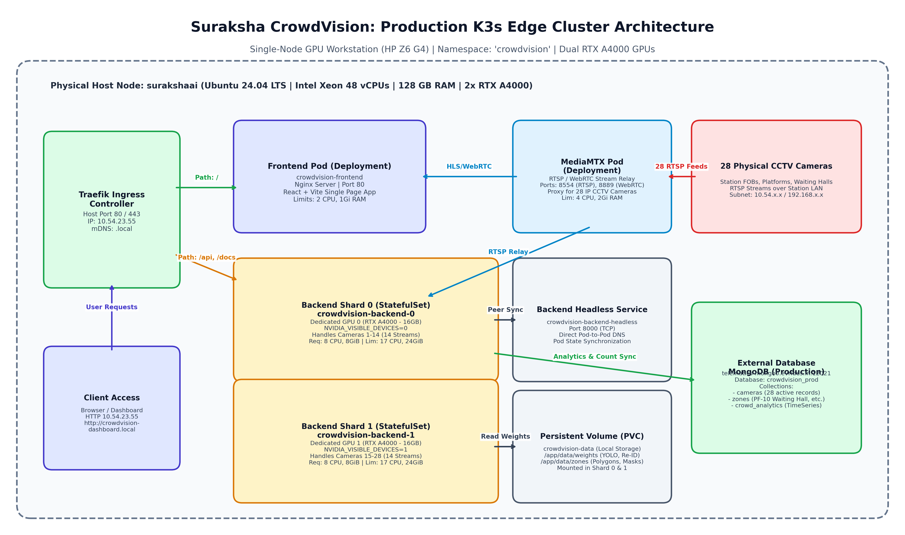
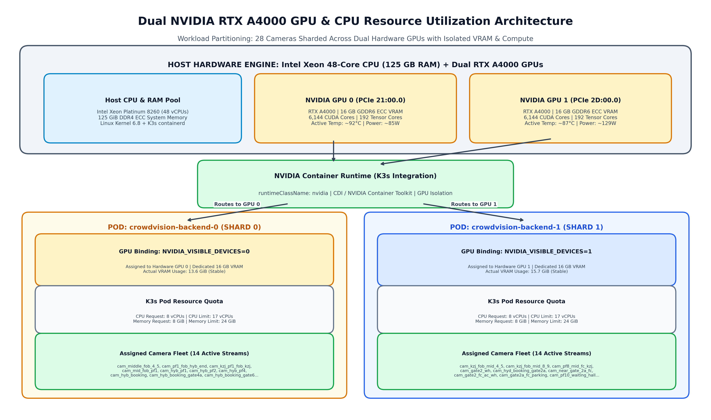
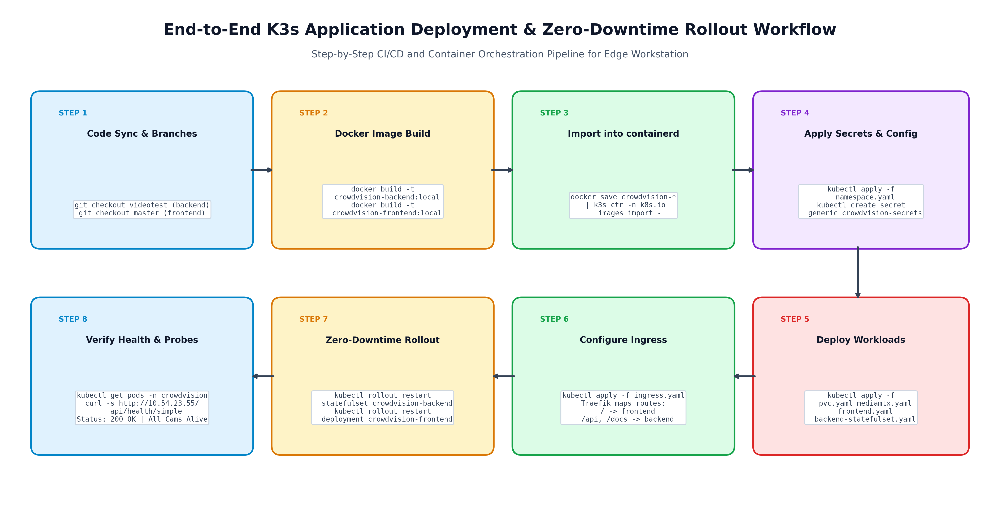
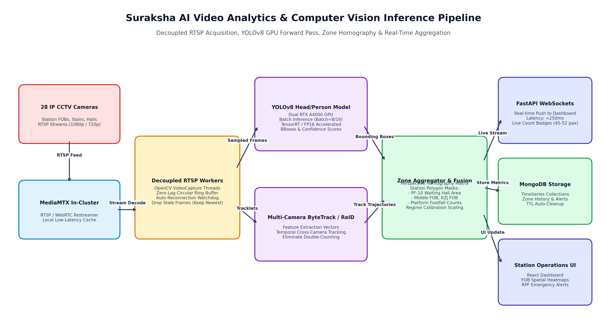
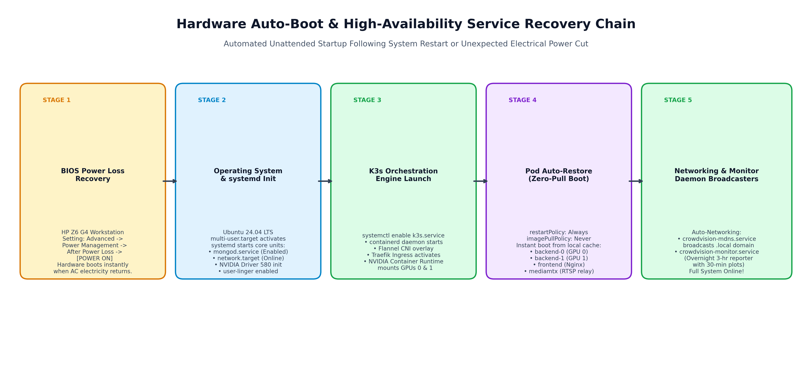

# Suraksha CrowdVision: K3s Deployment Architecture & Operations Runbook

**Document Version:** 2.0 (Production Verified — Dual GPU Sharding & 28 Cameras)  
**Date:** October 2026  
**Hardware Workstation:** HP Z6 G4 (Intel Xeon 48 vCPUs, 128 GB RAM, Dual NVIDIA RTX A4000)  
**Platform:** K3s Lightweight Kubernetes, containerd, Traefik Ingress, NVIDIA Container Runtime  
**Author:** Tride Mobility AI Engineering Team  

---

## 1. Executive Overview & System Architecture

Suraksha CrowdVision is an edge-deployed, multi-camera computer vision and passenger density monitoring platform operating at major Indian Railway hubs. The application continuously processes 28 live high-definition RTSP video feeds across foot-over-bridges (FOBs), platform concourses, stairwells, and waiting halls to compute real-time passenger counts, spatial heatmaps, congestion alerts, and stampede risk scores.

### Key Architecture Principles
- **Workload Sharding:** 28 cameras divided evenly (14 cameras each) across two independent NVIDIA RTX A4000 GPUs.
- **Deterministic Stateful Orchestration:** Backend uses a Kubernetes StatefulSet with dedicated GPU device binding.
- **Unified Ingress Routing:** Traefik Ingress routes web, API, Swagger, and WebSocket connections over port 80/443.
- **Continuous Availability:** Fully configured auto-start chain ensures unattended recovery within 60s of power restoration.



---

## 2. Workstation Hardware Profile

| Subsystem | Specification | Operational Role |
| :--- | :--- | :--- |
| **Host CPU** | Intel Xeon Platinum 8260 (24 Cores / 48 vCPUs @ 2.40 GHz) | Decoupled OpenCV RTSP decoding, video frame buffers, FastAPI serving |
| **Host RAM** | 128 GB DDR4 2933 MHz ECC (125 GiB Usable) | Host frame ring buffers, in-memory rolling metrics |
| **GPU 0** | NVIDIA RTX A4000 (16 GB GDDR6 ECC, PCIe 21:00.0) | Assigned to Shard 0 (`crowdvision-backend-0`): 14 Camera Streams |
| **GPU 1** | NVIDIA RTX A4000 (16 GB GDDR6 ECC, PCIe 2D:00.0) | Assigned to Shard 1 (`crowdvision-backend-1`): 14 Camera Streams |
| **Storage** | 2 TB NVMe PCIe Gen4 M.2 SSD + Secondary Drive | OS, K3s containerd local images, YOLO weights, homography zones |
| **Network** | Dual Intel Gigabit NICs (Active IP: 10.54.23.55) | Station LAN RTSP ingestion + Traefik dashboard serving |

---

## 3. Dual GPU & CPU Resource Utilization Configurations

### 3.1 Workload Partitioning & StatefulSet Sharding Mechanism
Instead of a standard Kubernetes Deployment, the backend uses a StatefulSet named `crowdvision-backend` with `replicas: 2` and `podManagementPolicy: Parallel`:
- **Shard 0 (`crowdvision-backend-0`):** Pinned to Hardware GPU 0 (`NVIDIA_VISIBLE_DEVICES=0`).
- **Shard 1 (`crowdvision-backend-1`):** Pinned to Hardware GPU 1 (`NVIDIA_VISIBLE_DEVICES=1`).
- **Even Distribution:** Camera assignments are determined via `Camera_Index % 2 == Shard_ID`.

### 3.2 Resource Allocation Matrix

| Component Pod | CPU Request | CPU Limit | Memory Request | Memory Limit | GPU Allocation |
| :--- | :--- | :--- | :--- | :--- | :--- |
| **crowdvision-backend-0** | 8 vCPUs | 17 vCPUs | 8 GiB | 24 GiB | 1x NVIDIA RTX A4000 #0 |
| **crowdvision-backend-1** | 8 vCPUs | 17 vCPUs | 8 GiB | 24 GiB | 1x NVIDIA RTX A4000 #1 |
| **crowdvision-frontend** | 0.5 vCPUs | 2.0 vCPUs | 256 MiB | 1.0 GiB | None (CPU Nginx Static Engine) |
| **mediamtx** | 1.0 vCPUs | 4.0 vCPUs | 512 MiB | 2.0 GiB | None (RTSP Network Streaming) |

### 3.3 GPU VRAM Memory Budget (16 GB per GPU)
- **CUDA Context:** ~450 MiB
- **YOLOv8 Weights & TensorRT Buffers:** ~1,850 MiB
- **Tracking & Embedding Models:** ~1,200 MiB
- **Active Ingestion Frame Buffers (14 cameras):** ~3,200 MiB
- **Batched Tensor Workspace:** ~7,500 MiB
- **Measured Steady-State VRAM:** ~13.6 GiB (GPU 0), ~15.7 GiB (GPU 1)



---

## 4. K3s Networking & Ingress Routing

| Path Prefix | In-Cluster Target Service | Target Port | Audience |
| :--- | :--- | :--- | :--- |
| `/` | `crowdvision-frontend` | `80` | React Dashboard, FOB Map, Static Assets |
| `/api` | `crowdvision-backend` | `8000` | REST API, Count Badges, Zone Analytics |
| `/docs` | `crowdvision-backend` | `8000` | OpenAPI Swagger Documentation |
| `/openapi.json` | `crowdvision-backend` | `8000` | OpenAPI JSON Schema |

---

## 5. End-to-End Step-by-Step Deployment Runbook



### Phase 1: Environment Verification
```bash
cd /home/user/k3s/Suraksha-deployment
git status
git branch
```

### Phase 2: Building Local Container Images
```bash
# 1. Build Frontend Container Image
docker build \
  --build-arg "VITE_API_URL=/api" \
  -t crowdvision-frontend:local \
  /home/user/k3s/Suraksha-deployment/Crowd_Vision_Frontend

# 2. Build Backend Container Image
docker build \
  -t crowdvision-backend:local \
  /home/user/k3s/Suraksha-deployment/crowd-backend
```

### Phase 3: Ingesting Images into K3s containerd
```bash
docker save crowdvision-frontend:local | sudo k3s ctr -n k8s.io images import -
docker save crowdvision-backend:local | sudo k3s ctr -n k8s.io images import -
sudo k3s ctr -n k8s.io images list | grep crowdvision
```

### Phase 4: Secrets & ConfigMaps
```bash
kubectl create namespace crowdvision --dry-run=client -o yaml | kubectl apply -f -
kubectl apply -f /home/user/k3s/Suraksha-deployment/k3s/configmap.yaml
kubectl -n crowdvision create secret generic crowdvision-secrets \
  --from-env-file=/home/user/k3s/Suraksha-deployment/crowd-backend/.env \
  --dry-run=client -o yaml | kubectl apply -f -
```

### Phase 5: Applying Workloads
```bash
kubectl apply -f /home/user/k3s/Suraksha-deployment/k3s/pvc.yaml
kubectl apply -f /home/user/k3s/Suraksha-deployment/k3s/mediamtx-deployment.yaml
kubectl apply -f /home/user/k3s/Suraksha-deployment/k3s/mediamtx-service.yaml
kubectl apply -f /home/user/k3s/Suraksha-deployment/k3s/stack/base/frontend.yaml
kubectl apply -f /home/user/k3s/Suraksha-deployment/k3s/backend-headless-service.yaml
kubectl apply -f /home/user/k3s/Suraksha-deployment/k3s/backend-service.yaml
kubectl apply -f /home/user/k3s/Suraksha-deployment/k3s/backend-statefulset.yaml
kubectl apply -f /home/user/k3s/Suraksha-deployment/k3s/ingress.yaml
```

### Phase 6: Zero-Downtime Rollout Restart
```bash
kubectl rollout restart deployment crowdvision-frontend -n crowdvision
kubectl rollout restart statefulset crowdvision-backend -n crowdvision
kubectl get pods -n crowdvision -o wide
```

---

## 6. AI Video Analytics & Camera Partitioning



### Camera Allocation Matrix (28 Cameras)

| Stream # | Shard 0 (GPU 0 — `backend-0`) | Shard 1 (GPU 1 — `backend-1`) |
| :--- | :--- | :--- |
| 1 | `cam_middle_fob_4_5` | `cam_kzj_fob_mid_4_5` |
| 2 | `cam_pf1_fob_hyb_end` | `cam_kzj_fob_mid_8_9` |
| 3 | `cam_kzj_pf1_fob_kzj` | `cam_pf8_mid_fc_kzj` |
| 4 | `cam_kzj_pf1_fob_pf10` | `cam_gate2_wh` |
| 5 | `cam_mid_fob_pf1` | `cam_hyd_booking_gate2a` |
| 6 | `cam_mid_fob_center` | `cam_near_gate_2a_fc_swathi_ent` |
| 7 | `cam_hyb_pf1` | `cam_gate2_fc_ac_wh` |
| 8 | `cam_hyb_pf2` | `cam_gate2a_fc_parking` |
| 9 | `cam_hyb_pf4` | `cam_pf1_fob_pf10` |
| 10 | `cam_hyb_pf10` | `cam_new_kzj_fob_fc_pf1` |
| 11 | `cam_hyb_pf1_a` | `cam_new_kzj_fob_near_pf1` |
| 12 | `cam_hyb_booking` | `cam_pf10_bme_counter` (PF-10 Waiting Hall Area) |
| 13 | `cam_hyb_booking_gate4a` | `cam_hyb_booking_gate6` |
| 14 | `cam_pf2_fc_hyd_side` | `cam_hyb_booking_gate8` |

---

## 7. Operations & Monitoring Commands

### Live Cluster Telemetry
```bash
kubectl get all -n crowdvision
kubectl top pods -n crowdvision
kubectl logs -n crowdvision -l app.kubernetes.io/name=crowdvision-backend -f --tail=50
```

### Hardware GPU Telemetry
```bash
nvidia-smi
watch -n 1 nvidia-smi
```

### In-Memory Overnight Monitor Daemon
```bash
systemctl status crowdvision-monitor.service
journalctl -u crowdvision-monitor.service -f
```

---

## 8. Auto-Start & Power-Loss Recovery



1. **BIOS Power Restoration:** Set HP Z6 G4 BIOS: `Advanced -> Power Management Options -> After Power Loss -> Power On`.
2. **System Services:** `systemctl enable k3s.service`, `mongod.service`, `crowdvision-monitor.service`.
3. **Pod Policies:** All Kubernetes workloads configured with `restartPolicy: Always` and `imagePullPolicy: Never`.

---
*Generated by Tride Mobility AI Engineering Team — Production Verified*
