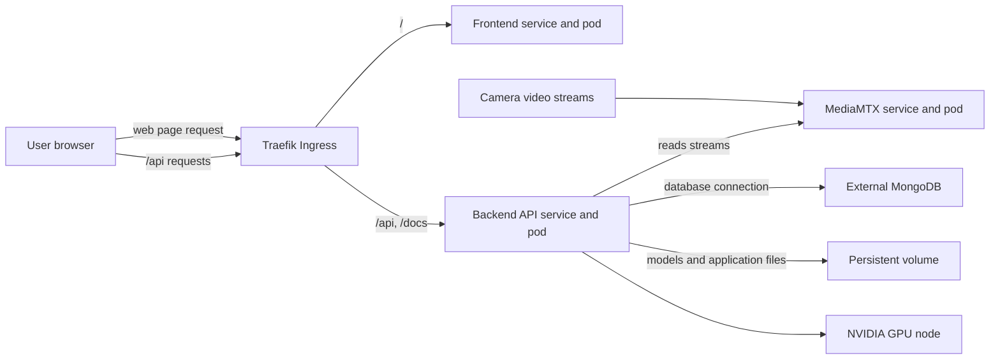

give me # CrowdVision on K3s

## Application overview

The current application deployment is in `k3s/stack/`. It runs the web frontend,
the API backend, and MediaMTX in the `crowdvision` namespace. Traefik sends web
requests to the frontend and API requests to the backend. The backend uses a GPU
for video analysis, stores files and model weights on a persistent volume, and
connects to MongoDB configured outside this K3s stack.



## Current stack manifests

Apply the stack with one of its Kustomize overlays. The base files define the
application; the overlay selects images and environment-specific settings.

| Manifest | Purpose |
| --- | --- |
| `stack/base/namespace.yaml` | Creates the `crowdvision` namespace. |
| `stack/base/configmap.yaml` | Non-secret backend settings, including model and data paths. |
| `stack/base/pvc.yaml` | Persistent storage for models and application data. |
| `stack/base/backend.yaml` | Runs the API backend; the workstation overlay adds GPU settings. |
| `stack/base/frontend.yaml` | Runs the web frontend. |
| `stack/base/mediamtx.yaml` | Runs MediaMTX and its in-cluster service for video streams. |
| `stack/base/ingress.yaml` | Routes `/` to the frontend and API/documentation paths to the backend. |
| `stack/overlays/local/` | Uses locally built images in K3s. |
| `stack/overlays/workstation/` | Uses registry images and enables the workstation GPU configuration. |

`stack/base/mongodb.yaml` is not included by the base Kustomization. MongoDB is
external in the current stack; provide its connection settings through the
Kubernetes Secret. Do not put real credentials in committed YAML files.

## Deploy the current stack

For a local K3s setup, run this from the repository root. The script builds and
imports the images, creates the application Secret from the backend environment
file, and applies the local overlay.

```bash
./k3s/stack/deploy-local.sh
```

For a GPU workstation, first configure the image names and tags in
`stack/overlays/workstation/kustomization.yaml`, then apply that overlay:

```bash
kubectl apply -k k3s/stack/overlays/workstation
```

Check the running resources and API health:

```bash
kubectl -n crowdvision get pods,services,ingress
curl http://<k3s-node-ip>/api/health/simple
```

Before starting video analysis, put the required model weights in the persistent
volume and configure camera stream URLs and MongoDB credentials.

## Legacy manifests in this folder

The YAML files directly under `k3s/` are a separate, older backend-only bundle.
`k3s/kustomization.yaml` applies its namespace, configuration, storage, MediaMTX,
backend, services, and ingress. It does not deploy the frontend. Therefore,
`kubectl apply -k k3s/` deploys the legacy bundle; use `kubectl apply -k
k3s/stack/overlays/local` or the deployment script for the current full
application.
